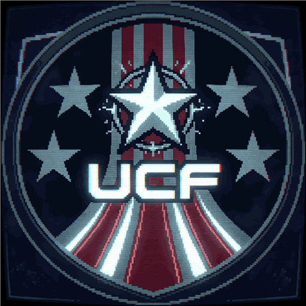

	

<h1 align="center">UCFSS13</h1>

	<a href="https://cm-ss13.com/wiki">
		<picture>
			<source media="(prefers-color-scheme: dark)" srcset=".github/assets/wiki-light.png">
			<source media="(prefers-color-scheme: light)" srcset=".github/assets/wiki-dark.png">
			
		</picture>
	</a>
	<a href="https://docs.cm-ss13.com">
		<picture>
			<source media="(prefers-color-scheme: dark)" srcset=".github/assets/docs-light.png">
			<source media="(prefers-color-scheme: light)" srcset=".github/assets/docs-dark.png">
			
		</picture>
	</a>

	
	
	

## About

**UCFSS13** is a private fork of [Colonial Marines SS13](https://github.com/cmss13-devs/cmss13), a strategic roleplay-focused team deathmatch game built in [BYOND](https://www.byond.com) on the [Space Station 13](https://spacestation13.com) engine.

There is no separate Discord or wiki for this fork — for game rules, mechanics, and general how-to-play information, use **[CM-SS13's own wiki](https://cm-ss13.com/wiki)** linked above; almost everything there applies here unchanged unless noted in this repository's own commits/changelog.

## Inspired By

This project would not exist without the work of the **[CM-SS13 development team](https://github.com/cmss13-devs/cmss13)** — the base game, art, sound, and the vast majority of the codebase originate from their repository. If you're looking to contribute upstream, or just want to see the project this fork is built on, go there first.

## Building

> [!IMPORTANT]
> This codebase cannot be compiled using Dream Maker directly — **you must use the build tool**.
> Install [BYOND](https://www.byond.com/download/) first, then run `bin/server.cmd` to build and start the server.
> See the [Installation Guide](tools/build/README.md) for the full walkthrough. Building directly in DreamMaker is deprecated and will error.

## Useful Links

- **[Setting up a Development Environment](https://cm-ss13.com/wiki/Guide_to_Git)** — gets you a Visual Studio Code environment with a working BYOND debugger.
- **[Contributing Rules](.github/CONTRIBUTING.md)** — maintainer structure and pull request rules for this repository.
- **[Code Standards](.github/guides/STANDARDS.md)** — how code should be structured to be accepted here, plus DreamMaker quirks to watch for.
- **[Code Style](.github/guides/STYLES.md)** — formatting conventions used across the codebase.
- **[tgui README](tgui/README.md)** — all new UI in this project is built with tgui; start here.

> [!TIP]
> New to contributing and not sure where to start? CM-SS13's community-maintained **[Guide to Contributing](https://cm-ss13.com/wiki/Contributing_to_the_Game)** is a good primer and mostly applies here too.

## Licenses

| License | Applies to |
| --- | --- |
|  | All code, unless a file header or this section says otherwise. See the [GNU Affero General Public License v3](http://www.gnu.org/licenses/agpl.html). |
|  | Icons and sound, unless stated otherwise. See the [Creative Commons 3.0 BY-SA license](https://creativecommons.org/licenses/by-sa/3.0/). Authorship for CC BY-SA assets is the active CM-SS13 development team unless a commit says otherwise. |
|  | Commits before [`9a001bf`](https://github.com/cmss13-devs/cmss13/commit/9a001bf520f889b434acd295253a1052420860af) (14 Sep 2020), which are licensed under [GNU General Public License v3](https://www.gnu.org/licenses/gpl-3.0.html) and may be used in closed-source repositories. |
